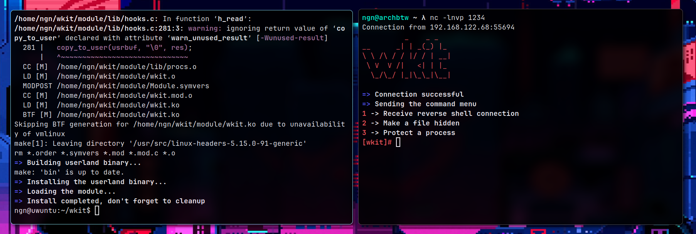

# shrk | stealthy rootkit for modern kernels
shrk is a free (as in freedom) and open source GNU/Linux LKM rootkit for modern 64 bit kernels,
it comes with an userland agent, DNS based C2 server and a web interface

</br>

> [!CAUTION]
> This software is designed and shared only for educational and
> research purposes. It's is provided without warranty and the
> distribution platform or the developers of the software are not
> responsible for any material, moral or legal damage that may occur
> due to incorrect or unethical use of the software.

## screenshot


## features
- support for 5.15+ 64 bit kernels
- easy setup with docker
- easy installation with automated shell script
- automated cron and bashrc persistence
- simple web interface and DNS based C2
- can hide/protect files, processes and network connections

## installation
to install the server, you can use docker:
```bash
docker run -v $PWD/data:/shrk/server/data            \
           -p 1053:1053/udp -p 7070:7070/tcp         \
           -e SHRK_PASSWORD=supersecret              \
           -e SHRK_PATH=/no_one_here                 \
           -e SHRK_HTTP_ADDR=0.0.0.0:7070            \
           -e SHRK_C2_ADDR=0.0.0.0:1053              \
           -e SHRK_HTTP_URL=http://myserver.net:7070 \
           -e SHRK_C2_URL=dns://myserver.net:1053    \
           --name shrk ghcr.io/ngn13/shrk:latest
```
you can also do all the fancy, yknow, HTTPS reverse proxy and stuff

also see the next sections for a full list of available environment options

## confiugration
here's a full list of environment configuration variables:

- `SHRK_HTTP_ADDR`: address that the HTTP web interface will listen on
- `SHRK_C2_ADDR`: address that the C2 web interface will listen on
- `SHRK_HTTP_URL`: URL which the clients and the users will use to access the web interface
- `SHRK_C2_URL`: URL which the clients will use to access the C2 server
- `SHRK_SCRIPT`: path for the client installation script
- `SHRK_SOURCE`: path for the client source archive (`make release`)
- `SHRK_STATIC`: path for the static directory (contains static CSS and JS)
- `SHRK_VIEWS`: path for the views direcotry (contains render engine templates)
- `SHRK_DB`: path for the database directory (contains emma watson's nudes /s)
- `SHRK_PATH`: path that will serve the web interface (other paths will return a fake 404, it's just for protection)
- `SHRK_PASSWORD`: password for the web interface
- `SHRK_DEBUG`: enable/disable debug messages

you can directly pass these to the container with `-e` (as shown in the installation section)

## contribute
there are debug options for all the seperate pieces of this project, so feel free to play around with them
and feel free to contribute back to the project if you end up doing some cool things

also feel free to open up issues just to ask about stuff or just to make fun of my dogshit code

## resources
here are few resources I used during the development of this project:

- [LKM programming guide](https://sysprog21.github.io/lkmpg/)
- [xcellerator's kernel hacking guide](https://github.com/xcellerator/linux_kernel_hacking) (hooks are outdated)
- [Linux kernel teaching](https://linux-kernel-labs.github.io/refs/heads/master/)

also [bootlin](https://elixir.bootlin.com/linux) is so really good for digging up source, highly recommend it
